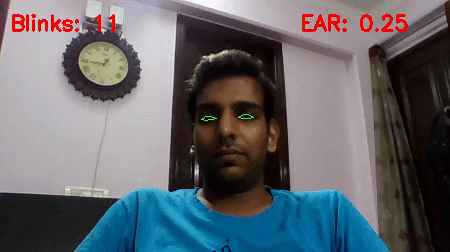

# EYE BLINK DETECTION WITH OPENCV AND DLIB
### Detects if a person is blinking using just Python, OpenCV and dlib

Very simple and effective blink detector.

All thanks to Adrian Rosebrock (from [pyimagesearch](https://www.pyimagesearch.com/)) for making
great tutorials. This project is inspired from his blog: [Eye blink detection with OpenCV, Python, and dlib](https://www.pyimagesearch.com/2017/04/24/eye-blink-detection-opencv-python-dlib/).
I have included the author's code and the one I wrote my self as well.

## **Key Points**
1. Steps involved:
    1. Localize the face in the image
    2. Detect the key facial structures on the face ROI
    3. Extract out the eyes landmarks.
    4. Calculate EAR (eye aspect ratio)
    5. Threshold the EAR to determine if the person is blinking.
2. Assumptions:
    1. We already have the trained face detector and face landmark detector.
3. **EAR** (Eye Aspect Ratio) formula is as follows:


4. The eye aspect ratio will remain approximately constant when the eyes are open
and then will rapidly approach zero during a blink, then increase again as the eye opens. 
5. The dlib's face detector is an implementation of **One Millisecond Face Alignment with an Ensemble of Regression Trees** paper by Kazemi and Sullivan (2014).
6. 68 coordinates are detected for the given face by the face detector.
7. dlib's framework can be trained to predict any shape. Hence it can be used for custom shape detections as well.
8. Used dlib's pre-trained face detector based on the modification of the standard **Histogram of Oriented Gradients + Linear SVM method** for object detection.
9. Used opencv's convexHull function to determine the contour for the detected eye landmarks
10. This method uses just the eye aspect ratio as the metric to determine if a person has blinked or not.
11. However, due to noise in the video stream, subpar facial landmark detections, or fast changes in viewing angle,
this approach could produce false-positive detections, reporting that a blink has taken place when in reality the person had not blinked.
12. To make this system more robust, Soukupová and Čech recommened that:
    1. Computing the eye aspect ratio for the Nth frame, along with eye aspect ratios for N - 6 and N + 6 frames,
    then concatenating these eye aspect ratios to form a 13 dimensional feature vector.
    2. Training a Support Vector Machines (SVM) on these feature vectors.
    3. This combination of temporal-based feature detector and SVM classifier helps
    reduce false-positive blink detections and improves the overall accuracy of the blink
    detector.

 ## **Requirements: (with versions I tested on)**
 1. python          (3.7.3)
 2. opencv          (4.1.0)
 3. numpy           (1.61.4)
 4. imutils         (0.5.2)
 5. dlib            (19.17.0)

 ## **Commands to run the detection:**
For detections using webcam video
 ```
python detect_blinks.py --shape-predictor shape_predictor_68_face_landmarks.dat
```

For detections using saved video
 ```
python detect_blinks.py --shape-predictor shape_predictor_68_face_landmarks.dat --video video.mp4
```

## **Results:**
The results are awesome. We can see very fast and pretty accurate blink detections.




## **The limitations**

This method uses just the eye aspect ratio as the metric to determine if a person has blinked or not. 
However, due to noise in the video stream, subpar facial landmark detections, or fast changes in viewing angle,
this approach could produce false-positive detections, reporting that a blink has taken place when in reality the person had not blinked.

This can be solved by using SVM classification as described above in key points section.
